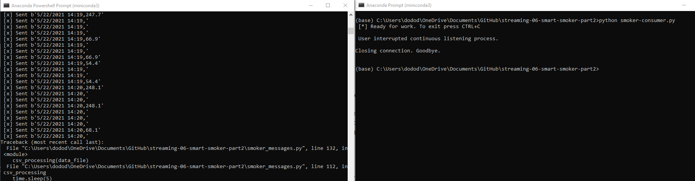

## streaming-06-smart-smoker-part2
# Tanya Fagaly
# February 11, 2023
https://github.com/RealNumberI/streaming-06-smart-smoker-part2

> Use RabbitMQ to distribute tasks to multiple workers

One process will create task messages. Multiple worker processes will share the work. 

## The Problem / Challenge To Solve

We want to stream information from a smart smoker. Read one value every half minute. (sleep_secs = 30)

smoker-temps.csv has 4 columns:

    [0] Time = Date-time stamp for the sensor reading
    [1] Channel1 = Smoker Temp --> send to message queue "01-smoker"
    [2] Channel2 = Food A Temp --> send to message queue "02-food-A"
    [3] Channel3 = Food B Temp --> send to message queue "03-food-B"

## The data
The data collected are temperatures from a BBQ smoker, the smoker cooking Food A, and the smoker cooking Food B.
A time stamp is associated with each temperature in the data. 
The data contains a header row.

## The output
The output is a string of binary that represents the timestamp and temperature data

## The programs
The program smoker_messages.py retrieves the data and converts it into binary messages.  It then creates a producer to send the messages.
The program smoker-consumer.py reads the messages from the producer and prints warnings if the data says that a tmperature crosses over a threshold.

# Instructions
1. Open two anaconda terminals.  
2. With the csv file in the same location as the .py file, run the smoker_messages.py file in one terminal.  
3. In the other terminal, run the smoer-consumer.py file in it.
4. When you want to stop the message, hit ctl-C in the terminal window.  This will stop the program in both windows.

## Screenshot showing the timestamps of the messages sent.

